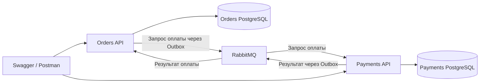

# Gozon

Учебный backend интернет-магазина на **C# / .NET 8**: создание заказов и асинхронная обработка оплаты через RabbitMQ.

Проект состоит из двух сервисов с отдельными базами PostgreSQL. Orders создаёт заказ, Payments обрабатывает списание и отправляет результат обратно. Пользователь взаимодействует с API через Swagger или Postman; веб-интерфейс не предусмотрен.

## Возможности

- Создание заказа, просмотр списка и статуса заказов пользователя.
- Создание счёта, пополнение и просмотр баланса.
- Асинхронная оплата со статусами `PendingPayment`, `Paid`, `PaymentFailed`.
- Transactional Outbox в обоих сервисах и Inbox в Payments.
- Проверка повторной обработки по идентификатору сообщения и заказа.
- Условное обновление баланса с проверкой версии записи и достаточности средств.

## Технологии

C#, .NET 8, ASP.NET Core Minimal API, Entity Framework Core 8, PostgreSQL 16, RabbitMQ, Docker Compose, Swagger/OpenAPI.

## Архитектура



Создание заказа и запись события в Outbox выполняются в одной транзакции. Фоновый процесс отправляет событие в RabbitMQ. Payments проверяет Inbox, выполняет попытку списания и сохраняет результат с событием ответа. Orders получает ответ и обновляет статус заказа.

## Быстрый запуск

Требуются запущенный Docker Desktop с Docker Compose и Git. Для запуска в контейнерах локальный .NET SDK не нужен. Порты 8081, 8082, 5433, 5434, 5672 и 15672 должны быть свободны.

```bash
git clone https://github.com/elinakocharyan777/gozon.git
cd gozon
docker compose up -d --build
docker compose ps
```

| Сервис | Адрес |
|---|---|
| Orders Swagger | http://localhost:8081/swagger |
| Payments Swagger | http://localhost:8082/swagger |
| Orders health | http://localhost:8081/health |
| Payments health | http://localhost:8082/health |
| RabbitMQ management | http://localhost:15672 — `guest` / `guest` |

Первый запуск может занять несколько минут. Для диагностики:

```bash
docker compose logs --tail=100 orders payments
```

Остановить контейнеры с сохранением их текущего состояния:

```bash
docker compose stop
```

Продолжить работу: `docker compose start`. В текущей конфигурации нет явно настроенных постоянных томов для баз данных и RabbitMQ; пересоздание контейнеров не следует использовать как способ сохранить данные.

## Пример использования

Идентификатор пользователя передаётся в `X-User-Id` или параметре `user_id`. Это учебный способ выбора пользователя, а не аутентификация.

Команды ниже предназначены для Terminal на macOS/Linux. Начни с нового пользователя `demo-user`.

```bash
# Создать счёт
curl -X POST 'http://localhost:8082/accounts?user_id=demo-user'

# Пополнить на 100
curl -X POST 'http://localhost:8082/accounts/topup?user_id=demo-user' \
  -H 'Content-Type: application/json' -d '{"amount":100}'

# Создать заказ на 30
curl -X POST 'http://localhost:8081/orders?user_id=demo-user' \
  -H 'Content-Type: application/json' -d '{"amount":30}'

# Через несколько секунд проверить заказы и баланс
curl 'http://localhost:8081/orders?user_id=demo-user'
curl 'http://localhost:8082/accounts/balance?user_id=demo-user'
```

Ожидаемый результат после обработки события: статус заказа `Paid`, баланс `70`. Для проверки недостатка средств создай заказ на сумму `1000`: ожидается `PaymentFailed`, баланс остаётся прежним. Повторный запуск всех команд меняет данные; для нового сценария используй другой `user_id`.

Коллекция запросов: [Gozon.postman_collection.json](postman/Gozon.postman_collection.json).

## Структура

```text
Gozon.sln
 docker-compose.yml
 src/
   BuildingBlocks/Gozon.Contracts/  # События и статусы
   Services/Orders/Orders.Api/      # Заказы и результат оплаты
   Services/Payments/Payments.Api/  # Счета и обработка оплаты
 postman/                           # Коллекция API-запросов
```


